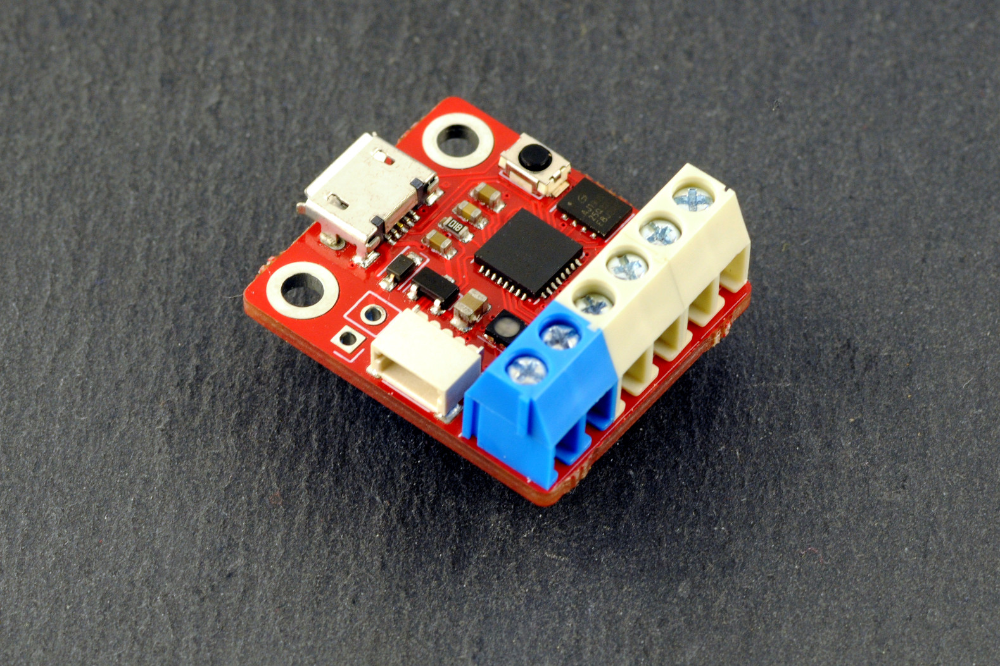

# FIDI 

FIDI is a small development board running Adafruit's CircuitPython, featuring 6 terminal block connectors and a qwiic connector, designed for fast prototyping. It runs on the ATSAMD21 microcontroller, a 32-bit Arm Cortex M0+ clocked at 48Mhz, as found on many popular Arduino-compatible boards.

For more info, see https://www.omzlo.com/fidi

# Acknowledgement 

This design borrows largely from SERPENTE, by Arturo182 (https://github.com/arturo182/serpente_hw).
